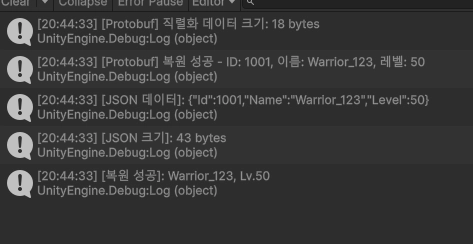
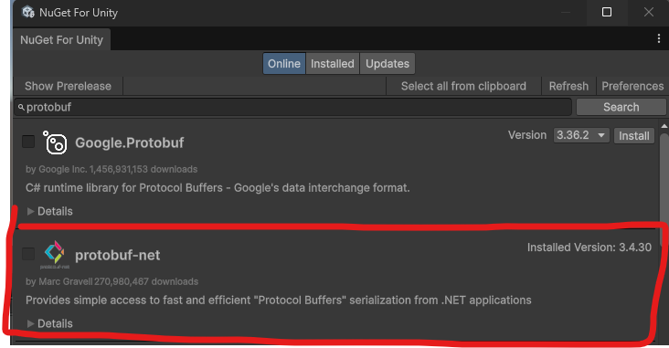
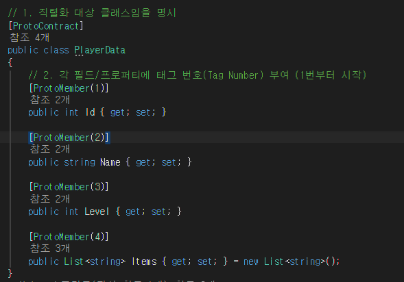

  
protobuf를 사용하면 데이터 압축 크기에 있어서 이득을 볼수 있다.
## 목차

- [ Protobuf의 핵심 개념 및 동작 원리](#protobuf의-핵심-개념-및-동작-원리)
- [protobuf 장단점](#protobuf의-주요-장점)
- [ JSON / XML과의 차이점](#json--xml과의-차이점-왜-쓸까)
- [ .proto 문법 완벽 정리](#proto-문법-완벽-정리-proto3-기준)

- [필드 번호(Tag Number) 주의사항](#필드-번호tag-number-주의사항)
- [설치 방법](#설치방법)
- [사용법](#사용법)
---

# Protobuf의 핵심 개념 및 동작 원리

Protobuf는 기본적으로 "선 정의, 후 생성" 방식으로 동작합니다.

- `.proto` 파일 정의: IDL(Interface Definition Language)을 사용해 주고받을 데이터 구조(Schema)를 정의합니다.
- `protoc` 컴파일: 프로토콜 버퍼 컴파일러(protoc)를 사용해 원하는 언어(C#, C++, Java, Python, Go 등)의 소스 코드로 변환합니다.

- 직렬화 및 역직렬화: 생성된 클래스를 프로젝트에 가져와 객체를 바이너리(Binary) 데이터로 바꾸거나(직렬화), 바이너리를 객체로 복원(역직렬화)합니다.

---

# Protobuf의 주요 장점
- **작은 데이터 크기와 빠른 속도** (High Performance)

    - JSON, XML과 같은 텍스트 기반 포맷과 달리 데이터를 압축된 바이너리(Binary) 포맷으로 직렬화합니다.

    - 필드 이름을 패킷에 포함하지 않고 숫자(Tag)로 대체하므로, 데이터 크기가 현저히 작고 네트워크 대역폭(Bandwidth)을 대폭 절약할 수 있습니다.

    - 파싱(Parsing) 속도가 매우 빨라 CPU 연산량이 적습니다.

- **강력한 스키마 기반 타입 검증** (Type Safety)

    - .proto 파일에 데이터 구조와 타입을 명확하게 정의합니다.

    - 컴파일 시점에 타입을 검증하므로, 런타임에서 발생할 수 있는 데이터 타입 불일치 에러를 사전에 방지할 수 있습니다.

- **자동 코드 생성 및 다중 언어 지원** (Polyglot Support)

    - protoc 컴파일러를 통해 C++, Java, Python, Go, C#, Dart, Ruby 등 다양한 언어로 직렬화/역직렬화 코드가 자동 생성됩니다.
    
    - 서로 다른 언어로 작성된 클라이언트와 서버 간의 통신이 매우 매끄럽습니다.

- **뛰어난 하위/상위 호환성** (Backward & Forward Compatibility)

    - 필드 번호(Tag Number)를 기반으로 동작하기 때문에, 기존 메시지에 새로운 필드를 추가하거나 삭제하더라도 이전 버전의 코드와 에러 없이 통신할 수 있습니다.

- **gRPC와의 뛰어난 궁합**
    -   gRPC 프레임워크의 기본 데이터 포맷이자 IDL(인터페이스 정의 언어)로 사용되어, 고성능 microservice(마이크로서비스) 또는 실시간 게임 서버 구축에 최적화되어 있습니다.

---
# Protobuf의 주요 단점

- **사람이 읽기 어려움** (Human Unreadable)

    - 데이터가 바이너리 형태로 변환되기 때문에 JSON처럼 사람이 직접 텍스트 에디터로 읽거나 수정할 수 없습니다.

    - 디버깅 시 패킷 디코딩 과정이나 별도의 툴(Postman의 Protobuf 지원 기능, Wireshark 플러그인 등)이 필수적입니다.

- **웹 브라우저(Front-end) 환경에서의 제약**

    - 웹 브라우저 및 JavaScript 환경은 JSON 처리에 최적화되어 있어, Protobuf나 gRPC를 직접 사용할 때 설정이 까다롭고 추가 라이브러리(gRPC-Web 등)가 필요합니다.
- **추가적인 빌드 단계** (Build Step Overhead)
    - .proto 파일 작성 후 반드시 컴파일 과정을 거쳐 소스 코드를 생성해야 합니다.

    - 프로젝트 빌드 파이프라인(CI/CD)에 Protobuf 컴파일 단계를 추가하는 번거로움이 있습니다.

-  **자체 설명 불가** (Not Self-Describing)

    - 데이터 패킷 자체에 필드 이름이나 스키마 정보가 들어있지 않기 때문에, 상대방이 해당 .proto 정의 파일(Schema)을 가지고 있지 않으면 데이터를 단독으로 해석할 수 없습니다.

- **복잡한 내부 표현의 비효율성**

    - 구조가 매우 간단한 소규모 데이터에서는 JSON과 성능 차이가 미비하거나 오히려 초기 설정 비용이 더 클 수 있습니다.
---

# JSON / XML과의 차이점 (왜 쓸까?)

| 특징 | JSON / XML | Protocol Buffers |
|---|---|---|
| 데이터 형태 | Human-readable 텍스트 | Compact 바이너리 (Binary) |
| 용량 및 속도 | 필드명까지 텍스트로 전달되어 용량이 큼 | 필드 번호(Tag) 기반 직렬화로 용량이 작고 빠름 |
| 스키마 (Schema) | 선택적 (Dynamic / Loose) | 필수 (`.proto` 파일) |
| 타입 안정성 | 주로 런타임에서 오류 확인 | 컴파일 시점에 타입 검증 |
| 주요 사용처 | Web REST API | 게임 서버 통신, MSA (Microservices), gRPC |

---

# .proto 문법 완벽 정리 (Proto3 기준)

```proto
// 1. 프로토버전 선언 (필수)

syntax = "proto3";

// 2. 패키지 선언 (이름 공간 충돌 방지)

package Game;

// 3. 타겟 언어별 옵션 (예: C# 네임스페이스 지정)

option csharp_namespace = "MyGame.Network";

// 4. 열거형 (Enum) - 첫 번째 값은 반드시 0이어야 함

enum UserRole {
    ROLE_GUEST = 0;
    ROLE_USER = 1;
    ROLE_ADMIN = 2;
}

// 5. 메시지 (Data Structure)

message UserProfile {
    // [타입] [필드명] = [필드 번호];

    int32 id = 1;
    string username = 2;
    UserRole role = 3;
    repeated string tags = 4;
    map<string, string> attributes = 5;
}

// 6. 메시지 중첩 (Nested Message)

message Group {
    int32 group_id = 1;
    repeated UserProfile members = 2;
}
```
## 필드 번호(Tag Number) 주의사항

id = 1, username = 2에서 숫자 1, 2는 데이터의 값이 아니라 **바이너리상에서 해당 필드를 식별하는 고유 번호(Tag)**입니다.

1~15번: 1바이트로 인코딩되므로 자주 사용하는 필드에 할당하는 것이 유리합니다.
한 번 지정된 필드 번호는 변경하거나 재사용하면 안 됩니다. (하위 호환성 문제)

---
# 설치방법
- Nugetforunity 설치  
  
  
PackageManager에서 Add Package from git URL..클릭  
클릭 후 아래 링크 로 Nuget 설치
```
https://github.com/GlitchEnzo/NuGetForUnity.git?path=/src/NuGetForUnity
```


Nuget 클릭 -> Manage Nuget Packages 클릭    
  
  
Google.protobuf  와 Google.protobuf.Tools 설치

이러면 설치가 완료 되었다.

# 사용법
  
프로젝트에서 폴더에서 Packages폴더 진입   
  
Google ..폴더 -> tools ->windows x86 클릭    
    
그러면 protoc.exe 파일이 있는데 해당 위치에서   
사용할 데이터를 정의해야한다.  
일단 Text파일을 만든 후 파일을 연다.    
  
그다음 버전 선언 / 패키지 이름 정의  / 메시지 정의 를 해준다.  
메시지 정의가 사용할 데이터 타입으로 알고 있으면 되고  
해당 데이터는 값타입으로 정의가 안되는걸로 알고 있고 클래스로 만들어진다. 다만들었으면 저장하고 확장자를 txt에서 proto로 바꾼다.  

     
     
그리고 해당 폴더에서 cmd를 실행시킨 후 아래와 같은 명령어를 실행한다.  
```
protoc --csharp_out=.  (이름).proto
```  
   
하면은 cs 파일이 생성이 되는데 이걸 프로젝트 내부 폴더로 옮긴다.  
    
```
using PrptpPlayer;
using System.IO;
using UnityEngine;
using Google.Protobuf;
public class Test : MonoBehaviour
{
    // Start is called once before the first execution of Update after the MonoBehaviour is created
    void Start()
    {
        var data = new PlayerData
        {
            Level = 10,
            UserId = 12345,
            UserName = "PlayerOne",
            Damage = 250
        };

        byte[] bytes;
        using (MemoryStream stream = new MemoryStream())
        {
            data.WriteTo(stream);
            bytes = stream.ToArray();
        }
        Debug.Log($"Serialized Data: {bytes.Length}");
        var deserializedData = PlayerData.Parser.ParseFrom(bytes);
        Debug.Log($"Deserialized Data: UserId={deserializedData.UserId}, UserName={deserializedData.UserName}, Level={deserializedData.Level}, Damage={deserializedData.Damage}");
    }
}

```


