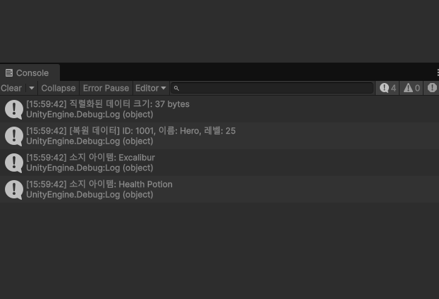

# Protobuf_net 설치하기

protobuf-net 설치

설치완료.
---
# protobuf-net 사용해보기 

protobuf-net은 Google -protobuf와 달리 .proto를 만들 필요가 없다.  

- 직렬화 대상의 클래스에 속성 달아주기
- 각 필드에 태그번호 부여하기
```
public class NewMonoBehaviourScript : MonoBehaviour
{
    // Start is called once before the first execution of Update after the MonoBehaviour is created
    void Start()
    {
        // -------------------------------------------------------------
        // 1. 객체 생성
        // -------------------------------------------------------------
        PlayerData originalPlayer = new PlayerData
        {
            Id = 1001,
            Name = "Hero",
            Level = 25
        };
        originalPlayer.Items.Add("Excalibur");
        originalPlayer.Items.Add("Health Potion");

        // -------------------------------------------------------------
        // 2. 직렬화 (Serialization): 객체 -> byte[]
        // -------------------------------------------------------------
        byte[] bytes;
        using (MemoryStream stream = new MemoryStream())
        {
            // Serializer.Serialize를 이용해 스트림에 기록
            Serializer.Serialize(stream, originalPlayer);
            bytes = stream.ToArray();
        }

        Debug.Log($"직렬화된 데이터 크기: {bytes.Length} bytes");

        // -------------------------------------------------------------
        // 3. 역직렬화 (Deserialization): byte[] -> 객체
        // -------------------------------------------------------------
        PlayerData deserializedPlayer;
        using (MemoryStream stream = new MemoryStream(bytes))
        {
            // Serializer.Deserialize<T>를 이용해 복원
            deserializedPlayer = Serializer.Deserialize<PlayerData>(stream);
        }

        // -------------------------------------------------------------
        // 4. 결과 출력
        // -------------------------------------------------------------
        Debug.Log($"[복원 데이터] ID: {deserializedPlayer.Id}, 이름: {deserializedPlayer.Name}, 레벨: {deserializedPlayer.Level}");
        foreach (var item in deserializedPlayer.Items)
        {
            Debug.Log($"소지 아이템: {item}");
        }
    }
}

```
# 결과.
